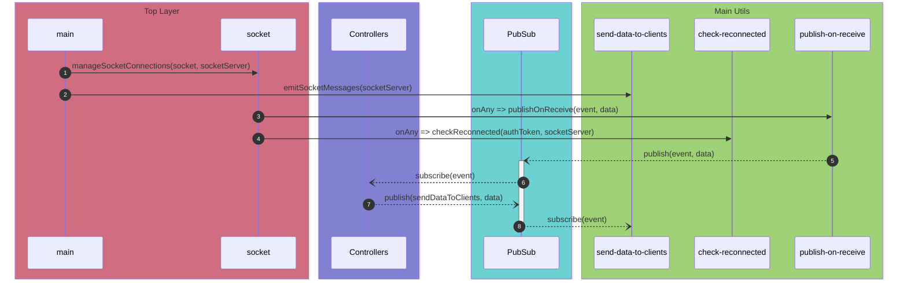

# main.ts

- Initialize server
- Initialize socket sever

### mangeSocketConnections()

- On client connect, passing socket and socket server to manage socket connections.  
  `onSocketConnection => manageSocketConnections(socket, socketServer)`

### emitSocketMessages()

- Passing socket server, which use to emit messages to client when needed.  
  `emitSocketMessages(socketServer)`

# socket.ts

- Manage socket connections.
- Authenticate player using `tokenPlayerMap`
- Emit tokens to new players

### publishOnReceive()

- Send all events and data, to do necessary processes and publish.  
  `onAnySocketEvent => publishOnReceive(event, data)`

### checkReconnected()

- When a player disconnected, check whether use is reconnected after a time period.
  `onSocketDisconnection => checkReconnected(authToken, socketServer)`

# send-data-to-clients.ts

- Listening to pubsub events
- Emit data to all clients in a socket room or to a single client when pubsub triggered.

# publish-on-receive.ts

- Run schema validation base on event
- Verify user belongs to the tournament
- Publish data to pubsub

# check-reconnected.ts

- Check user reconnected after a waiting time.
- If user not reconnected, delete player `tokenPlayerMap` and the game.
