[<- Back](../index.md)

# Player Creating Tournament

```mermaid
sequenceDiagram
    autonumber
    participant C as Client
    participant S as Server
    participant M as Memory

    C->>S: POST /room [Req01]

    rect rgb(40, 40, 40)
        S-->>S: Validate Player name
        S-->>S: Create player
        S-->>S: Create tournament
        S-->>S: Establish socket connection
    end

    S-->>M: Store Client [Data01]
    S-->>M: Store Room [Data02]
    S->>C: Response [Res01]

```



---

## Req01 (Player send username without tournament id) | HTTP => Socket

```json
"method": "POST"
"upgrade": "websocket"
"path": "/room"
"body": {
    "playerName": ""
}
```

## Data01 (Record with session(auth) id, socket id & player id)

```json
"type": "STORE/CLIENT"
"data": {
    "session": AUTH_ID,
    "socketId": SOCKET_ID,
    "playerId": PLAYER_ID
}
```

## Data02 (Record with socket room id & tournament id)

```json
"type": "STORE/ROOM"
"data": {
    "room": SOCKET_ROOM_ID,
    "tournamentId": TOURNAMENT_ID
}
```

## Res01 (Response with snapshot of the state)

```json
"set-cookie": "auth=AUTH_ID"
"body": {
    "playerId": PLAYER_ID,
    "tournamentId": TOURNAMENT_ID,
    "snapshot": {
        "stateModelSegment": {}
    }
}
```

references: [Data Models](../../../../libs/models/src/lib/sockets)

~ Further consider ~  
When player joining if the player sent a session id, the server will check if the session id is valid.  
If session is valid, the server will use the session id to retrieve the player id and other details. Also, server will disconnect the any old socket connection and replace with new one. \*If player didn't send a tournament id server will check whether player with session id is already assigned to a tournament.  
If session id is invalid, the server will create a new player id and send it back to the client.
