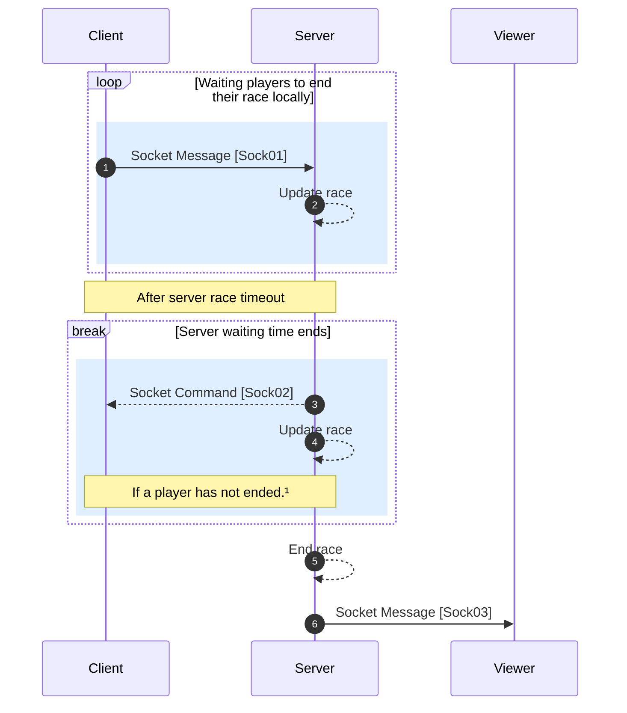

[<- Back](../index.md)

# Ending Race (By timeout or Force end)



¹ Player should send either [Sock1] (end by timeout) or race text completed type log to consider as race ended.

---

## Sock01 (Race end by local timeout) | To server | Command

```json
"type": "TS/INF/TIMEOUT_PLAYER",
"data": {
    // Server will get player id using session and socket id.
    "timestamp": 0
}
```

## Sock02 (Force end) | From server (To specific player) | Command

```json
"type":" FS_ONE/CMD/FORCE_END",
"data": {
    // Server timestamp
    "timestamp": 0
}

```

## Sock03 (Send Leaderboard) | From server (To all) | Message

```json
"type": "FS_ALL/INF/SEND_LEADERBOARD",
"data": {
    "leaderboard":{
        "raceId": RACE_ID,
        "entries": <LeaderboardEntry>[]
    }
}
```

### **LeaderboardEntry**

```ts
interface LeaderboardEntry {
  playerId: string;
  playerName: string;
  playerAvatarLink: string;
  status: 'Completed' | 'Timeout';
  values: FinishedPlayerValues | TimeoutPlayerValues;
}
```

references: [Data Models](../../../../libs/models/src/lib/sockets)
