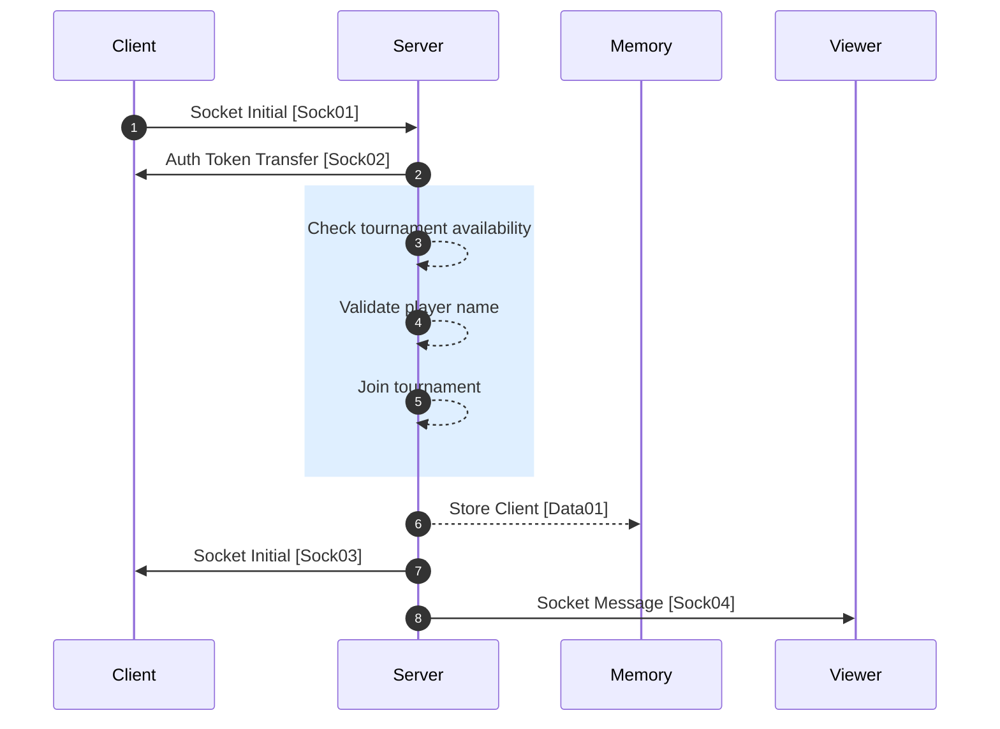
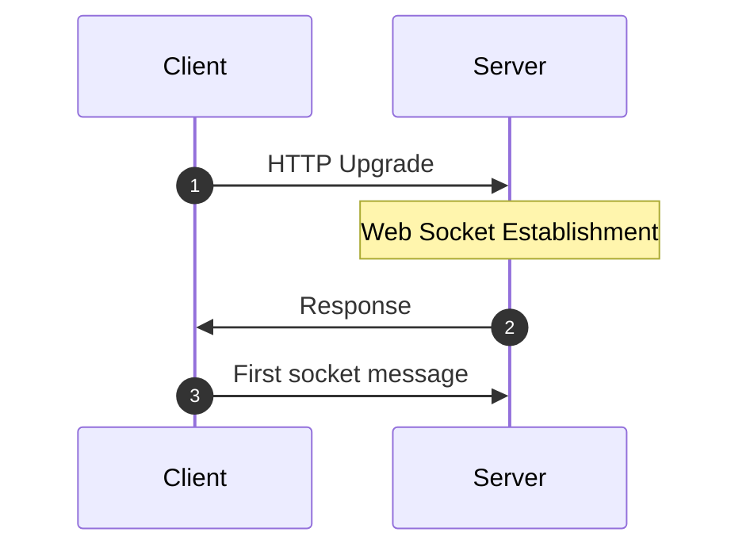

[<- Back](../index.md)

## Player Joining room



---

## Sock01 (Player sends username with tournament id) | HTTP Upgrade | Initial



HTTP --> WS

```json
"method": "GET",
"upgrade": "websocket",
"path": "/",
"headers":{
    "auth": AUTH_TOKEN, // if user has token before. Otherwise, no headers.
}
```

_Auth token will be only available if the user has logged in before and disconnected from the server but not closed or refreshed the browser!_

Socket message

```json
"type": "TS/INT/JOIN_LOBBY",
"data": {
    "playerName": "name",
    "tournamentId": "id"
}
```

## Sock02 (Server sends auth token) | Socket Upgrade | Response

```json
"type": "FS/INT/AUTH_TOKEN",
"data": {
    "authToken": AUTH_TOKEN
}
```

## Data01 (Record with auth token, socket id & player id)

```json
"type": "STORE/CLIENT",
"data": {
    "authToken": AUTH_TOKEN,
    "socketId": SOCKET_ID,
    "playerId": PLAYER_ID
}
```

## Sock03 (Response with a snapshot of the state) | From Server | Initial

```json
"type": "FS/INT/JOIN_LOBBY",
"data": {
    "playerId": PLAYER_ID,
    "tournamentId": TOURNAMENT_ID,
    "snapshot": {
        "stateModelSegment": {
            "playersModel": <Player>[],
            "tournamentsModel": <Tournament>[],
            "racesModel": <Race>[],
            "leaderboardsModel": <Leaderboard>[]
        }
    }
}
```

## Sock04 (Send data to other players) | From Server (To all) | Message

```json
"type": "FS_ALL/INF/PLAYER_JOIN",
"data": {
    "player": {
        "id": PLAYER_ID,
        "name": "",
        "avatarLink": "",
        "state": <PlayerState>
    },
    "tournament": {
        "state": <TournamentState>,
        "players": <Player>[]
    }
}
```

references: [Data Models](../../../../libs/models/src/lib/sockets)

~ Further consider ~  
When a player joins if the player sends a token, the server will check whether the token is valid or not.  
If the token is valid, the server will use the token to retrieve the player id and other details.
If the token is invalid, the server will create a new player id and send it back to the client.
