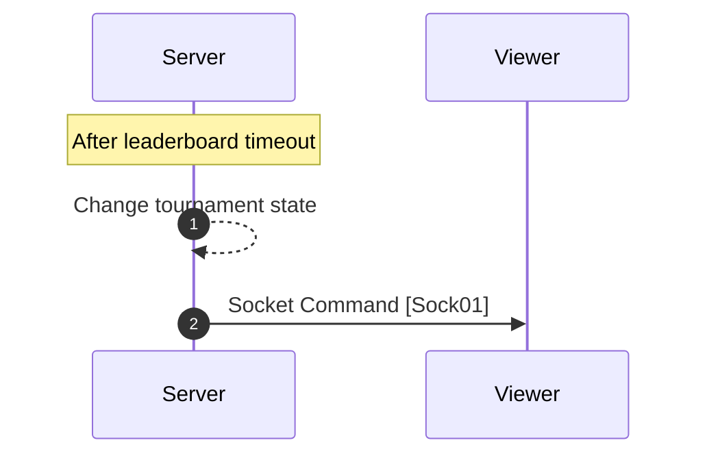

[<- Back](../index.md)

# Reset Lobby (Timeout after leaderboard)



---

## Sock01 (Reset lobby) | From server (To all) | Command

```json
"type": "FS_ALL/CMD/RESET_LOBBY"
"data": {}
```

references: [Data Models](../../../../libs/models/src/lib/sockets)
