[<- Back](../index.md)

# Player Creating Tournament

```mermaid
sequenceDiagram
    autonumber
    participant C as Client
    participant S as Server
    participant M as Memory

    C->>S: POST /room [Req01]

    rect rgb(40, 40, 40)
        S-->>S: Validate Player name
        S-->>S: Create player
        S-->>S: Create tournament
        S-->>S: Establish socket connection
    end

    S-->>M: Store Client [Data01]
    S-->>M: Store Room [Data02]
    S->>C: Response [Res01]

```



---

## Req01 (Player send username without tournament id) | HTTP => Socket

```json
"method": "POST"
"upgrade": "websocket"
"path": "/room"
"body": {
    "playerName": ""
}
```

## Data01 (Record with session(auth) id, socket id & player id)

```json
"type": "STORE/CLIENT"
"data": {
    "session": AUTH_ID,
    "socketId": SOCKET_ID,
    "playerId": PLAYER_ID
}
```

## Data02 (Record with socket room id & tournament id)

```json
"type": "STORE/ROOM"
"data": {
    "room": SOCKET_ROOM_ID,
    "tournamentId": TOURNAMENT_ID
}
```

## Res01 (Response with snapshot of the state)

```json
"set-cookie": "auth=AUTH_ID"
"body": {
    "playerId": PLAYER_ID,
    "tournamentId": TOURNAMENT_ID,
    "snapshot": {
        "stateModelSegment": {
            "playersModel": <Player>[],
            "tournamentsModel": <Tournament>[],
            "racesModel": <Race>[],
            "leaderboardsModel": <Leaderboard>[]
        }
    }
}
```

references: [Data Models](../../../../libs/models/src/lib/sockets)
