[<- Back](../index.md)

## Player Joining room

```mermaid
sequenceDiagram
    autonumber
    participant C as Client
    participant S as Server
    participant M as Memory
    participant V as Viewer

    C->>S: POST /room/:id [Req01]

    rect rgb(40, 40, 40)
        S-->>S: Check tournament availability
        S-->>S: Validate player name
        S-->>S: Join tournament
    end

    S-->>M: Store Client [Data01]
    S->>C: Response [Res01]
    S->>V: Socket Message [Sock01]
```



---

## Req01 (Player send username with tournament id) | HTTP => Socket

```json
"method": 'POST',
"upgrade": "websocket",
"path": "/room/:id",
"body": {
    "playerName": ""
}
```

## Data01 (Record with session(auth) id, socket id & player id)

```json
"type": "STORE/CLIENT",
"data": {
    "session": AUTH_ID,
    "socketId": SOCKET_ID,
    "playerId": PLAYER_ID
}
```

## Res01 (Response with snapshot of the state)

```json
"set-cookie": "auth=AUTH_ID",
"body": {
    "playerId": PLAYER_ID,
    "tournamentId": TOURNAMENT_ID,
    "snapshot": {
        "stateModelSegment": {
            "playersModel": <Player>[],
            "tournamentsModel": <Tournament>[],
            "racesModel": <Race>[],
            "leaderboardsModel": <Leaderboard>[]
        }
    }
}
```

## Sock01 (Send data to other players) | From Server | Message

```json
"type": "FS/INF/PLAYER_JOIN",
"data": {
    "player": {
        "id": PLAYER_ID,
        "name": "",
        "avatarLink": "",
        "state": <PlayerState>
    },
    "tournament": {
        "state": <TournamentState>,
        "players": <Player>[]
    }
}
```

references: [Data Models](../../../../libs/models/src/lib/sockets)
