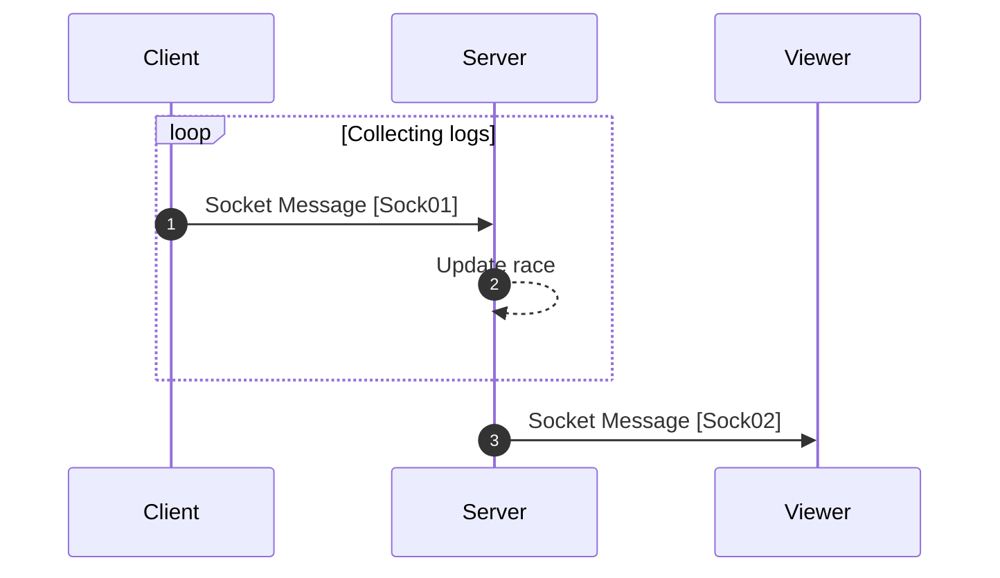

[<- Back](../index.md)

# Sending Type Logs (Start, Ongoing, End)



---

## Sock01 (Send type logs) | To server | Message

_This socket protocol will use to send the race start type log (`textLength` will be 0) and race end type log (`textLength` will be the length of the race text)._

```json
"type": "TS/INF/SEND_TYPE_LOG"
"data": {
    "race-id": RACE_ID,
    "player-log": {
        // Server will get player id using session and socket id.
        "textLength": 0,
        "timestamp": 0
    }
}
```

## Sock02 (Update type logs) | From server (To all) | Message

```json
"type": "FS_ALL/INF/UPDATE_TYPE_LOGS"
"data": {
    "raceId": RACE_ID,
    "playersWithLogs": <PlayerWithLogsPacket>[]
}
```

### **PlayerLogsCollection**

```ts
// Server sends player logs packet by packet, as the race continues.
interface PlayerLogsCollection {
    id: string;
    name: string;
    avatarLink: string;
    logs: [
        {
            textLength: number,
            timestamp: number
        }
        ...
    ];
    // Keeping last timestamp will make easy to merge updates from server to client.
    lastTimestamp: number;
}

```

references: [Data Models](../../../../libs/models/src/lib/sockets)
