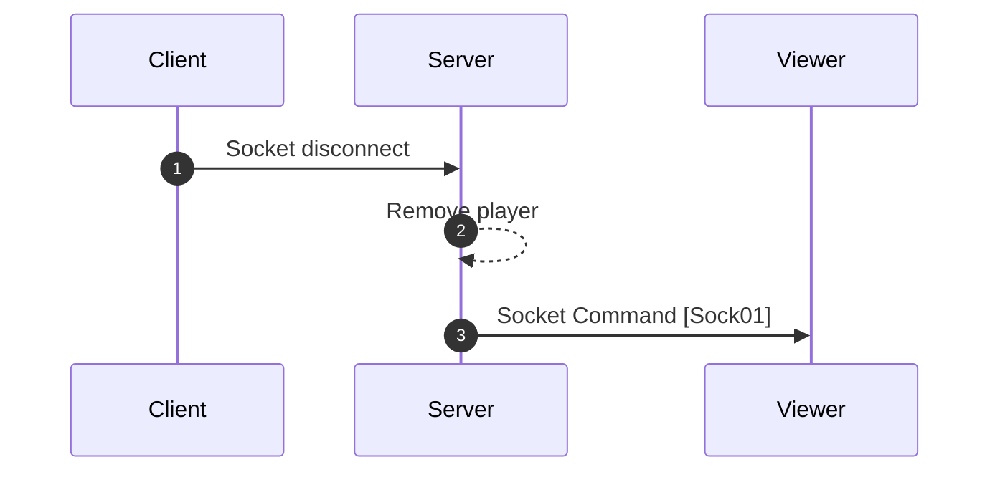

[<- Back](../index.md)

# Clearing(Removing) Player (Player disconnect)



---

## Sock01 (Clear player) | From server | Command

```json
"type": "FS/CMD/PLAYER_CLEAR",
"data": {
    "playerId": PLAYER_ID
}
```

references: [Data Models](../../../../libs/models/src/lib/sockets)
