[<- Back](../index.md)

# Ending Race (By timeout or Force end)

```mermaid
sequenceDiagram
    autonumber
    participant C as Client
    participant S as Server
    participant V as Viewer

    loop Waiting players to end their race locally
        rect rgb(40, 40, 40)
            C->>S: Socket Message [Sock01]
            S-->>S: Update race
        end
    end

    Note over S,C: After server race timeout

    break Server waiting time ends
        rect rgb(40, 40, 40)
            S-->>C: Socket Command [Sock02]
            S-->>S: Update race
            Note over S,C: If a player has not ended.¹
        end
    end

    S-->>S: End race
    S->>V: Socket Message [Sock03]
```



¹ Player should send either [Sock1] (end by timeout) or race text completed type log to consider as race ended.

---

## Sock01 (Race end by local timeout) | To server | Command

```json
"type": "TS/INF/TIMEOUT_PLAYER",
"data": {
    "playerId": PLAYER_ID,
    "timestamp": 0
}
```

## Sock02 (Force end) | From server | Command

```json
"type":" FS/CMD/FORCE_END"
"data": {
    "playerId": PLAYER_ID,
    "timestamp": 0
}

```

## Sock03 (Send Leaderboard) | From server | Message

```json
"type": "FS/INF/SEND_LEADERBOARD"
"data": {
    "leaderboard":{
        "raceId": RACE_ID,
        "entries": <LeaderboardEntry>[]
    }
}
```

references: [Data Models](../../../../libs/models/src/lib/sockets)
