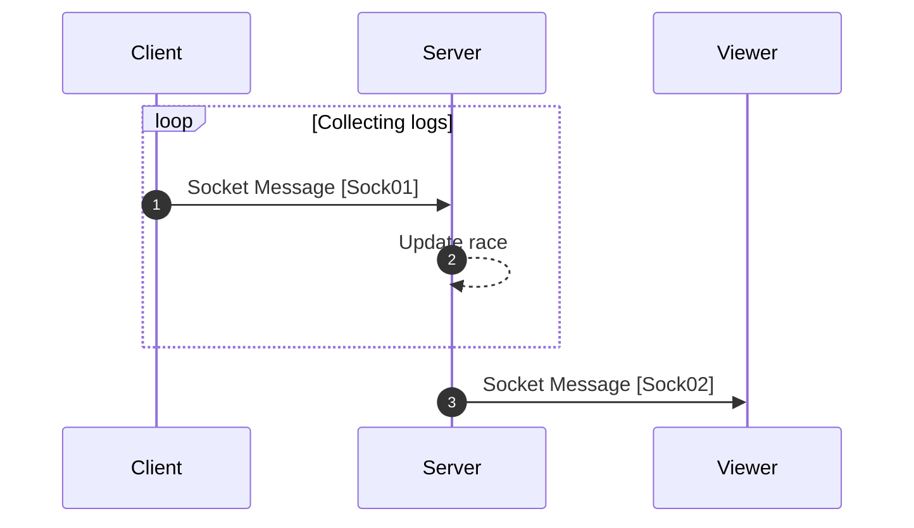

[<- Back](../index.md)

# Sending Type Logs (Start, Ongoing, End)



---

## Sock01 (Send type logs) | To server | Message

This socket protocol will use to sent race start type log (`textLength` will be 0) and race end type log (`textLength` will be the length of the race text).

```json
"type": "TS/INF/SEND_TYPE_LOG"
"data": {
    "race-id": RACE_ID,
    "player-log": {
        // Player data //
        "id": PLAYER_ID,
        "name": "",
        "avatarLink": "",

        // Log data //
        "logs": {
            "textLength": 0,
            "timestamp": 0
        }
    }
}
```

## Sock02 (Update type logs) | From server | Message

```json
"type": "FS/INF/UPDATE_TYPE_LOGS"
"data": {
    "raceId": RACE_ID,
    "playersWithLogs": <PlayerWithLogsPacket>[]
}
```

references: [Data Models](../../../../libs/models/src/lib/sockets)
