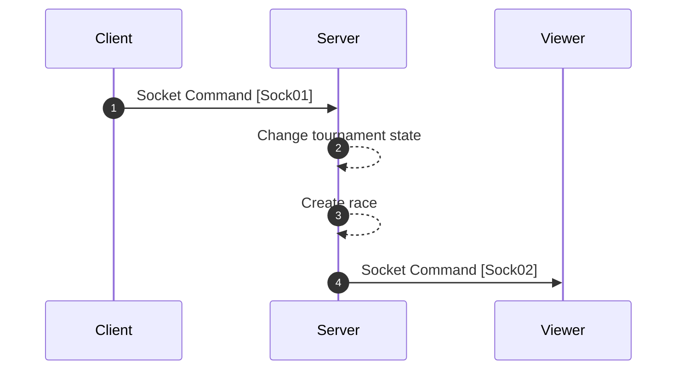

[<- Back](../index.md)

# Starting Race (AKA Starting Countdown)



---

## Sock01 (Press start button) | To server | Command

```json
"type": "TS/CMD/START_RACE"
"data": {
    "playerId": PLAYER_ID // Player who pressed the start button
}
```

## Sock02 (Start countdown) | From server | Command

```json
"type": "FS/CMD/START_COUNTDOWN"
"data": {
    "race": {
        "id": "",
        "text": "",
        "timeoutDuration": 0,
        "startedTimestamp": 0,
        "players": <PlayerWithLogs>[],
        "raceStartedBy": ""
    }
}
```

references: [Data Models](../../../../libs/models/src/lib/sockets)
