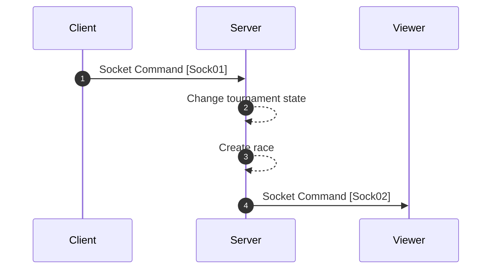

[<- Back](../index.md)

# Starting Race (AKA Starting Countdown)



---

## Sock01 (Press start button) | To server | Command

```json
"type": "TS/CMD/START_RACE"
"data": {}
```

// Race started player id will not send to the server. But the server will get it using session and socket id.

## Sock02 (Start countdown) | From server (To all) | Command

```json
"type": "FS_ALL/CMD/START_COUNTDOWN"
"data": {
    "race": {
        "id": "",
        "text": "",
        "timeoutDuration": 0,
        "startedTimestamp": 0,
        "playerLogs": <PlayerLogsCollection>[],
        "raceStartedBy": ""
}
```

### **PlayerLogsCollection**

```ts
interface PlayerLogsCollection {
    // Player details
    id: string;
    name: string;
    avatarLink: string;
    logs: [
        {
            textLength: number,
            timestamp: number
        }
        ...
    ];
}

```

references: [Data Models](../../../../libs/models/src/lib/sockets)
